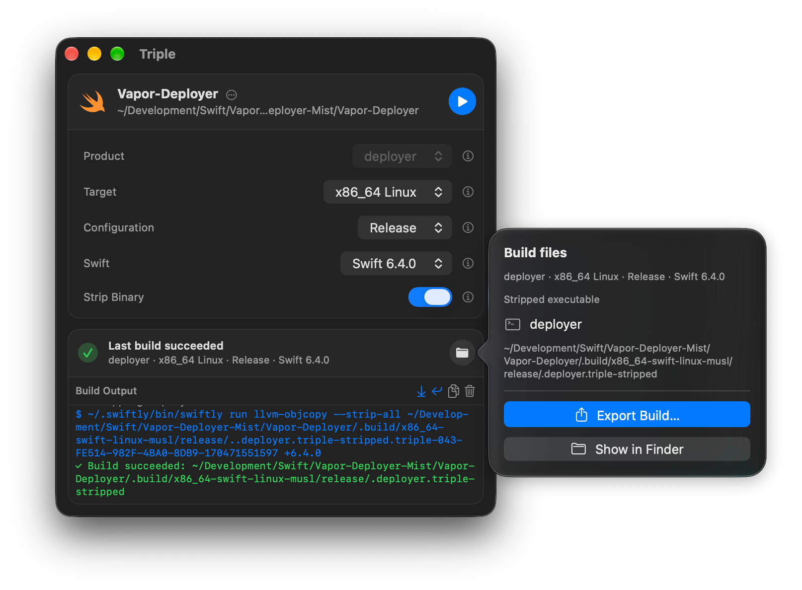

# Triple

Build Swift packages for Linux on your Mac. Triple creates statically linked
executables for ARM64 or x86-64 Linux Musl, checks the result, and exports it
with the resource bundles it needs.

  

## Download and install

Triple 0.2.0 is not available yet. Check [Releases](https://github.com/mottzi/TripleApp/releases)
for the download. The latest published app is still SwiftlyKitApp 0.1.1.

When Triple is available, open its DMG and drag **Triple** to **Applications**.
See the [0.2.0 release notes](Docs/releases/0.2.0.md).

If you use SwiftlyKitApp 0.1.1 or earlier, quit it and install Triple manually
once. Triple starts with new preferences. Your projects, exports, toolchains,
and SDKs stay in place. Later Triple releases can update from within the app.

## What you need

- An Apple silicon Mac with macOS 26.5 or later.
- A local Swift package with an executable product. Its code and dependencies
  must support Linux Musl.
- Internet access to download tools and package dependencies that are not
  already on your Mac.

Triple checks for Apple Command Line Tools, Swiftly, Swift, and the matching
Static Linux SDK. It asks before installing missing tools and tells you if
Swiftly needs an update. You can use Xcode's tools if they are already installed.

Build only packages you trust. Package manifests and plugins can run code with
your permissions. A build can also update the package's `Package.resolved` file.

## Build and export

1. Click **Select Package**. Choose a folder that contains `Package.swift`, or
   choose the file itself. You can also drag either into the window.
2. Review any tool installation request. When setup finishes, choose the
   executable product and the architecture of the Linux machine that will run it.
3. Use **Release** for an optimized build or **Debug** for debugging. Leave
   **Swift** on **Automatic**, or choose an exact version. Turn on **Strip Binary**
   to remove symbols from a copy of the executable.
4. Click the blue **Build** button, or press **Command-B**. Follow progress in
   **Build Output**. You can cancel the build or open error details if it fails.
5. After a successful build, click the **Build files** folder button beside the
   status. Choose **Export Build…**, then select or create an empty folder.

Automatic prefers a compatible version from the nearest `.swift-version` file
before choosing an installed or available Swift release.

Export copies the checked executable and its resource bundles without rebuilding.
Keep all exported files together on Linux. Static linking does not include the
resource bundles inside the executable. The executable runs on the selected
Linux architecture, not on your Mac.

Use **Show in Finder** to find the current build files. The **Package actions**
menu can clean build artifacts or reset all build storage. Export anything you
want to keep before you use these actions.

## Updates

Choose **Triple > Check for Updates…** to check now. In **Triple > Settings…**,
you can enable automatic checks and automatic download and installation.
Automatic installations take place when Triple quits. Update restarts wait for
active work in every window, including builds, exports, and tool installation.

## Help

Open **Help > Triple Help** for the built-in guide. If a build fails, include the
error details and relevant **Build Output** when you
[report an issue](https://github.com/mottzi/TripleApp/issues).

Prefer a terminal? Use [TripleCLI](https://github.com/mottzi/TripleCLI).
See also the [Triple library](https://github.com/mottzi/Triple) and
[Triple website](https://triple.mottzi.codes).
